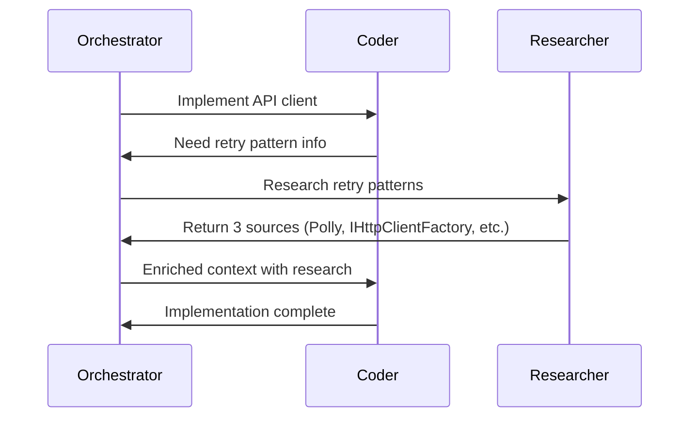

# Researcher Agent — Comprehensive Guide

The **Researcher** agent is a specialized research assistant that gathers information from multiple sources to help other agents complete their tasks effectively. It leverages web search, Microsoft Learn documentation, and library-specific resources via MCP servers.

## Overview

The Researcher agent expands the capabilities of the multi-agent orchestration system by providing on-demand access to external knowledge. When agents encounter unknown libraries, build errors, design patterns, or any scenario requiring current information, the Orchestrator can delegate research tasks to the Researcher agent.

**Key Capabilities:**

- **Web Search**: Access to real-time information, tutorials, and community knowledge
- **Microsoft Learn MCP**: Official Microsoft and Azure documentation
- **Context7 MCP**: Library-specific API documentation and usage examples

## Architecture Integration

### Agent Role

The Researcher is a first-class agent role (`AgentRole.Researcher`) integrated into the agent configuration system:

```csharp
public enum AgentRole
{
    Orchestrator,
    Planner,
    Coder,
    Designer,
    Researcher, // 🔍 New role for information gathering
    Fixer,
    BuildReviewer
}
```

### Tool Configuration

The Researcher is the only agent with all three external tool types enabled by default:

```csharp
new AgentConfiguration(
    Role: AgentRole.Researcher,
    Name: "Researcher",
    Model: "gpt-5.3-codex",
    Instructions: InstructionLoader.LoadInstructions(AgentRole.Researcher),
    Color: "#6610f2",
    Icon: "🔍",
    Tools: new AgentToolConfiguration(
        WebSearchEnabled: true,
        MicrosoftLearnMcpEnabled: true,
        Context7McpEnabled: true
    )
)
```

**Comparison with Other Agents:**

| Agent | Web Search | Microsoft Learn | Context7 | Reasoning |
|-------|-----------|----------------|----------|-----------|
| Orchestrator | ❌ | ❌ | ❌ | ✅ |
| Planner | ❌ | ❌ | ❌ | ✅ |
| Coder | ❌ | ❌ | ❌ | ✅ (+ file ops) |
| Designer | ❌ | ❌ | ❌ | ✅ |
| **Researcher** | **✅** | **✅** | **✅** | **✅** |
| Fixer | ❌ | ❌ | ❌ | ✅ (+ code analysis) |
| BuildReviewer | ❌ | ❌ | ❌ | ✅ (+ code analysis) |

## How Research Works

### 1. Research Request Model

When an agent needs information, a `ResearchRequest` is created:

```csharp
public sealed record ResearchRequest(
    AgentRole RequestingAgent,  // Which agent needs the research
    string Query,               // What information is needed
    string Context,             // Why the research is needed
    ResearchScope Scope,        // Type of research (Web, Docs, Examples, etc.)
    int MaxResults = 5          // Number of sources to return
);

public enum ResearchScope
{
    WebSearch,          // General web search
    Documentation,      // Official docs only
    CodeExamples,       // Code snippets and implementations
    BestPractices,      // Design patterns and conventions
    All                 // Search all sources
}
```

### 2. Research Response Model

The Researcher returns structured research results:

```csharp
public sealed record ResearchResponse(
    ResearchRequest Request,
    string Summary,                         // 2-3 sentence overview
    IReadOnlyList<ResearchSource> Sources,  // Detailed sources
    DateTimeOffset CompletedAt
);

public sealed record ResearchSource(
    string Title,       // Source title
    string Url,         // Source URL for verification
    string Excerpt,     // Key quote or summary
    string SourceType   // "web", "docs", "github", "library-docs"
);
```

### 3. Inter-Agent Communication

The Orchestrator coordinates research requests:

```
┌─────────────────┐
│  Coder Agent    │ "Need retry pattern for HttpClient"
└────────┬────────┘
         │ (detects research need)
         ▼
┌─────────────────┐
│  Orchestrator   │ Creates ResearchRequest
└────────┬────────┘
         │
         ▼
┌─────────────────┐
│  Researcher     │ Searches web + Microsoft Learn + Context7
└────────┬────────┘
         │ Returns ResearchResponse
         ▼
┌─────────────────┐
│  Orchestrator   │ Enriches context
└────────┬────────┘
         │ (provides research to requesting agent)
         ▼
┌─────────────────┐
│  Coder Agent    │ Uses research to implement solution
└─────────────────┘
```

## Usage Examples

### Example 1: Coder Needs Library Information

**Scenario**: Coder is implementing an API client and needs to know about retry patterns.

**Research Request:**

```csharp
var request = new ResearchRequest(
    RequestingAgent: AgentRole.Coder,
    Query: "Best practices for implementing retry policies in .NET HttpClient",
    Context: "Building an API client that needs resilience against transient failures",
    Scope: ResearchScope.All,
    MaxResults: 5
);
```

**Research Response** (abbreviated):

```markdown
# Research Summary

Researched best practices for implementing retry policies in .NET HttpClient.
Found 3 authoritative sources with implementation patterns: Polly library,
IHttpClientFactory integration, and exponential backoff patterns.

## Key Findings

1. **Polly Library**: Industry-standard resilience library
2. **IHttpClientFactory**: .NET Core 2.1+ with native Polly support
3. **Exponential Backoff**: Recommended to avoid overwhelming services

## Sources

### Microsoft Learn: Making HTTP requests with IHttpClientFactory
- **Type**: docs
- **URL**: https://learn.microsoft.com/en-us/dotnet/core/extensions/httpclient-factory
- **Relevance**: Official Microsoft documentation
- **Key Excerpt**: "IHttpClientFactory can be configured to use Polly-based policies..."

### Polly Documentation: Retry Policy
- **Type**: library-docs
- **URL**: https://github.com/App-vNext/Polly#retry
- **Key Excerpt**: "Retry can be configured for exponential backoff with jitter..."

## Recommendations

1. Use `IHttpClientFactory` with Polly via `AddPolicyHandler()`
2. Implement exponential backoff with jitter
3. Log retry attempts for observability
```

### Example 2: Build Error Resolution

**Scenario**: Build fails with CS0246 error.

**Research Request:**

```csharp
var request = new ResearchRequest(
    RequestingAgent: AgentRole.Fixer,
    Query: "CS0246: The type or namespace name 'HttpClient' could not be found",
    Context: "Build failed with missing namespace error",
    Scope: ResearchScope.Documentation | ResearchScope.WebSearch,
    MaxResults: 3
);
```

**Research Response Excerpt:**

```markdown
## Key Findings

1. **Missing Using Statements**: Most CS0246 errors caused by missing `using` directives
2. **SDK Version Mismatch**: Verify project targets correct .NET SDK
3. **Package References**: Ensure required NuGet packages are in .csproj

## Recommendations

1. Add `using System.Net.Http;` at top of file
2. Verify .csproj references `<TargetFramework>net10.0</TargetFramework>`
```

### Example 3: UI/UX Guidance

**Scenario**: Designer creating a dashboard layout.

**Research Request:**

```csharp
var request = new ResearchRequest(
    RequestingAgent: AgentRole.Designer,
    Query: "Modern CSS Grid layout patterns for responsive dashboards",
    Context: "Designer creating a monitoring dashboard UI",
    Scope: ResearchScope.WebSearch | ResearchScope.CodeExamples,
    MaxResults: 5
);
```

## Orchestrator Detection Logic

The Orchestrator can detect research needs in two ways:

### 1. Explicit Markers

Agents can explicitly request research using markers in their output:

```csharp
// Agent output:
"[RESEARCH_NEEDED: How to implement JWT authentication in ASP.NET Core]"
```

### 2. Heuristic Detection

The Orchestrator analyzes agent output for patterns indicating research needs:

- Questions about unknown libraries ("What is Polly?")
- Requests for recent changes ("Latest .NET best practices")
- Uncertainty phrases ("I'm not sure how to...", "Need information about...")
- Build errors referencing external dependencies

### 3. Failure-Triggered Research

After N failed attempts (configurable, default: 3), the Orchestrator automatically engages the Researcher:

```csharp
public sealed record OrchestrationConfiguration(
    // ...
    int MaxRetryAttempts = 3,
    int ResearchTriggerThreshold = 3  // Trigger research after 3 failures
);
```

**Example Flow:**

```
Builder: Attempt 1 - FAILED (CS0246 error)
Fixer:   Applies fix
Builder: Attempt 2 - FAILED (same error)
Fixer:   Applies different fix
Builder: Attempt 3 - FAILED (still failing)
→ Orchestrator: Triggers Researcher
Researcher: Finds solution (missing NuGet package)
Fixer:  Applies research-based fix
Builder: Attempt 4 - SUCCESS
```

## Testing with TemplateAgentClient

For CI/CD and deterministic testing, `TemplateAgentClient` provides mock research responses:

```csharp
var client = new TemplateAgentClient();
var result = await client.RunAsync(
    AgentRole.Researcher,
    "research HttpClient retry patterns",
    "/workspace",
    CancellationToken.None
);

// Returns deterministic mock research response with:
// - Summary of findings
// - 3 mock sources (Microsoft Learn, Polly docs, .NET blog)
// - Specific recommendations
```

**Test Coverage:**

- HttpClient/retry patterns → Polly + IHttpClientFactory
- Build errors → Missing using statements and package references
- CSS/layout → CSS Grid patterns and responsive design

## Flow Tracing and Visualization

All research interactions are traced and visualized:

### Events Generated

```csharp
// When research is requested
new ResearchRequestedEvent(
    Timestamp: DateTimeOffset.UtcNow,
    RequestingAgent: AgentRole.Coder,
    Query: "retry patterns",
    Scope: ResearchScope.All
);

// When research completes
new ResearchCompletedEvent(
    Timestamp: DateTimeOffset.UtcNow,
    RequestingAgent: AgentRole.Coder,
    SourcesFound: 3,
    Duration: TimeSpan.FromSeconds(2.5)
);

// Inter-agent communication event
new AgentCommunicationEvent(
    Timestamp: DateTimeOffset.UtcNow,
    FromAgent: AgentRole.Orchestrator,
    ToAgent: AgentRole.Researcher,
    CommunicationType: "research_request",
    Summary: "Requesting research: retry patterns"
);
```

### Mermaid Diagram

Research flows appear in generated sequence diagrams:



### Dashboard Visualization

The Aspire Web UI displays:

- **Agent Graph**: Researcher node with purple color (#6610f2) and 🔍 icon
- **Activity Feed**: Real-time research events
- **Flow Diagram**: Research request/response in sequence diagram

## Configuration and Customization

### Custom Tool Access

You can configure which agents have access to which tools:

```csharp
// Give Coder access to Context7 for API documentation
var coderConfig = store.Get(AgentRole.Coder) with
{
    Tools = new AgentToolConfiguration(
        Context7McpEnabled: true
    )
};
store.Update(coderConfig);
```

### Custom Instructions

Replace default Researcher instructions:

```csharp
var customInstructions = File.ReadAllText("custom-researcher.md");
var researcherConfig = store.Get(AgentRole.Researcher) with
{
    Instructions = customInstructions
};
store.Update(researcherConfig);
```

### Custom MCP Servers

Add your own MCP servers (future enhancement):

```csharp
new AgentToolConfiguration(
    WebSearchEnabled: true,
    MicrosoftLearnMcpEnabled: true,
    Context7McpEnabled: true,
    CustomMcpServers: new[]
    {
        "https://docs.mycompany.com/mcp",
        "https://internal-kb.corp/mcp"
    }
)
```

## Best Practices

### When to Request Research

**Good scenarios for research:**

- ✅ Unknown library or API usage patterns
- ✅ Build errors with unfamiliar causes
- ✅ Recent technology changes or new best practices
- ✅ Design patterns for specific use cases
- ✅ After multiple failed fix attempts

**Poor scenarios (don't need research):**

- ❌ Basic syntax questions already covered in agent instructions
- ❌ Project-specific code that wouldn't have external documentation
- ❌ Questions that can be answered with local file content

### Writing Good Research Queries

**Good queries:**

- Specific and focused: "HttpClient retry policies with Polly in .NET 10"
- Include version information: ".NET 10", "C# 13", "React 19"
- Contextual: What technology stack, what problem to solve

**Poor queries:**

- Too vague: "how to code"
- Too broad: "everything about web development"
- No context: "error" (which error?)

### Handling Research Results

When receiving research results:

1. **Validate Sources**: Check that sources are authoritative and recent
2. **Apply Recommendations**: Follow specific recommendations provided
3. **Cite Sources**: Include source URLs in code comments when helpful
4. **Learn Patterns**: Use research to understand best practices, not just copy code

## Troubleshooting

### Research Not Triggering

**Problem**: Agent needs information but Orchestrator doesn't trigger research.

**Solutions:**

- Use explicit `[RESEARCH_NEEDED: query]` markers in agent output
- Increase failure threshold if research should trigger sooner
- Check Orchestrator detection logic for heuristic patterns

### Research Returns Empty Results

**Problem**: Researcher returns no sources or irrelevant information.

**Solutions:**

- Refine query to be more specific
- Check that appropriate tools are enabled (Web, MCP servers)
- Verify MCP server connectivity (if using real Copilot implementation)

### Too Much Research (Performance)

**Problem**: Orchestration is slow due to excessive research calls.

**Solutions:**

- Implement research caching (future enhancement in roadmap)
- Increase `ResearchTriggerThreshold` to trigger research less often
- Use more specific research scopes (Documentation only, not All)
- Pre-load common knowledge into agent instructions

## Future Enhancements

See [roadmap.md](plans/roadmap.md) for planned improvements:

- **Research Caching**: Avoid duplicate queries
- **Multi-Turn Research**: Researcher asks clarifying questions
- **Custom Tool Registration**: Add your own MCP servers
- **Research Quality Scoring**: Rank sources by authority
- **Research History**: Session-scoped research log

## Related Documentation

- [Architecture](architecture.md) — Overall system design
- [Getting Started](getting-started.md) — Quick start guide
- [Roadmap](plans/roadmap.md) — Future enhancements
- [Plan: Researcher Implementation](plans/plan_260215_1800.md) — Original implementation plan

## Summary

The Researcher agent transforms the multi-agent orchestration system from a closed-loop code generator into an open system that can access external knowledge. By leveraging web search and authoritative documentation sources, the Researcher enables agents to:

- Handle unknown libraries and frameworks
- Resolve build errors with external dependencies
- Stay current with latest best practices
- Make informed architectural decisions

This results in more robust, knowledgeable, and adaptable code generation that can handle real-world complexity.
