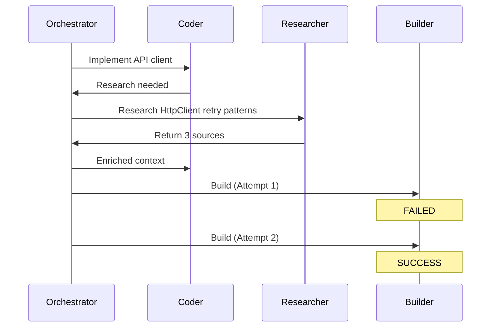

# Architecture

This document describes the architecture of the **ElBruno.AgentsOrchestration** libraries and samples.

## Overview

The solution implements Burke Holland's "Ultralight Orchestration" pattern as a reusable library suite for the .NET community. Multiple AI agents coordinate through a structured 6-step pipeline to generate software from natural-language prompts.

```
┌─────────────────────────────────────────────────────────────┐
│                         Samples                              │
│  ┌──────────────────┐  ┌──────────────────────────────────┐ │
│  │ Console App      │  │  Aspire App (Production Sample) │ │
│  │ (Minimal Example)│  │  ┌────────────────────────────┐ │ │
│  └────────┬─────────┘  │  │  Blazor UI + REST API     │ │ │
│           │            │  │  + Health Checks + Tracing│ │ │
│           │            │  └────────────────────────────┘ │ │
│           │            └──────────────────────────────────┘ │
│           │                                                 │
│  ┌────────▼─────────────────────────────────────────────┐  │
│  │        ElBruno.AgentsOrchestration.Core            │  │
│  │  ┌─────────────┐  ┌────────────────┐  ┌──────────┐ │  │
│  │  │ Template    │  │ Workspace      │  │App       │ │  │
│  │  │ AgentClient │  │ Manager        │  │Runner    │ │  │
│  │  └─────────────┘  └────────────────┘  └──────────┘ │  │
│  │         ▲                 ▲                  ▲       │  │
│  │         └─────────────────┼──────────────────┘       │  │
│  │                           │                          │  │
│  │  ┌─────────────────────────▼──────────────────────┐ │  │
│  │  │ ElBruno.AgentsOrchestration.Orchestration     │ │  │
│  │  │  ┌───────────────┐  ┌──────────────────────┐  │ │  │ │
│  │  │  │ Orchestration │  │ 18 Event Types      │  │ │  │ │
│  │  │  │ Service       │  │ Models              │  │ │  │ │
│  │  │  │ (6-step       │  │ IWorkspace          │  │ │  │ │
│  │  │  │  pipeline)    │  │                     │  │ │  │ │
│  │  │  └───────────────┘  └──────────────────────┘  │ │  │ │
│  │  │                │                               │ │  │ │
│  │  │  ┌────────────▼────────────────────────────┐  │ │  │ │
│  │  │  │ ElBruno.AgentsOrchestration.Abstractions│  │ │  │ │
│  │  │  │ ┌──────────┐ ┌────────┐ ┌────────────┐ │  │ │  │ │
│  │  │  │ │AgentRole │ │IAgent  │ │AgentFactory│ │  │ │  │ │
│  │  │  │ │AgentConf │ │Client  │ │AgentSession│ │  │ │  │ │
│  │  │  │ │AgentStore│ │        │ │Config Store│ │  │ │  │ │
│  │  │  │ └──────────┘ └────────┘ └────────────┘ │  │ │  │ │
│  │  │  └─────────────────────────────────────────┘  │ │  │ │
│  │  └──────────────────────────────────────────────┘ │  │ │
│  └─────────────────────────────────────────────────────┘  │
└─────────────────────────────────────────────────────────────┘
```

## NuGet Library Structure

The libraries are organized for reusability and minimal dependencies. Three packages form the core.

### ElBruno.AgentsOrchestration.Abstractions

**Zero-dependency** library with foundational types:

- **`AgentRole`** — enum with 11 agents: Orchestrator, Planner, Coder, Designer, Researcher, Fixer, BuildReviewer, SecurityExpert, TestingExpert, DocumentationExpert, SoftwareArchitect
- **`AgentConfiguration`** — immutable record with role, model, instructions, color, icon, and optional tool configuration
- **`AgentToolConfiguration`** — configuration for Copilot tools (web search, MCP servers)
- **`IAgentClient`** — interface for LLM providers to implement
- **`AgentFactory` / `AgentSession`** — create agent sessions and run prompts
- **`AgentConfigurationStore`** — thread-safe `ConcurrentDictionary`-backed config management
- **`InstructionLoader`** — loads Markdown instruction files

**Dependency graph:** None

**Use when:** Defining agents and their configuration in isolation.

### ElBruno.AgentsOrchestration.Orchestration

Depends only on Abstractions. Contains the pipeline engine:

- **`OrchestrationService`** — 6-step pipeline with full event streaming
- **`IWorkspace`** — trait for pluggable workspace strategies
- **18 event types** — sealed record hierarchy for monitoring (includes BuildReviewStarted/Completed)
- **Domain models** — `ExecutionPlan`, `ExecutionPhase`, `ExecutionTask`, `OrchestrationResult`

**Dependency graph:** → Abstractions

**Use when:** You need the orchestration engine with your own agent client and workspace.

### ElBruno.AgentsOrchestration.Core

References the two above. Production-ready toolkit:

- **`TemplateAgentClient`** — deterministic client for demo/test
- **`WorkspaceManager`** — `IWorkspace` implementation (timestamped directories)
- **`AppRunner`** — launch and manage generated applications
- **Instructions/** — Markdown prompts for all 6 agents
- **SDK references** — GitHub Copilot, Microsoft Agents AI packages

**Dependency graph:** → Orchestration → Abstractions  
**Also depends on:** `GitHub.Copilot.SDK`, `Microsoft.Agents.AI.*`

**Use when:** You want everything ready to go.

## AI Agents Overview

The system includes **11 specialized agents**: 6 core orchestration agents plus 5 specialist agents for extended capabilities.

### Core Orchestration Agents

These agents drive the 6-step pipeline:

1. **Planner** (Step 1) — Analyzes requirements and creates implementation plans
2. **Orchestrator** (Steps 2, 4, 6) — Coordinates task delegation and orchestration flow
3. **Coder** (Step 3) — Generates application code and business logic
4. **Designer** (Step 3) — Creates user interfaces and visual components
5. **Fixer** (Step 4) — Detects and fixes build errors automatically
6. **BuildReviewer** (Step 5) — Analyzes code quality, performance, and best practices

### Specialist Agents

These agents provide extended capabilities and can be consulted by core agents:

1. **Researcher** — Searches external documentation, web resources, and APIs
2. **SecurityExpert** — Validates security and identifies vulnerabilities
3. **TestingExpert** — Generates comprehensive unit and integration tests
4. **DocumentationExpert** — Creates API docs, READMEs, architecture diagrams
5. **SoftwareArchitect** — Validates architecture and enforces design patterns

For detailed agent descriptions and consulting strategies, see [All Agents](agents.md).

## Samples

### ConsoleSimple

A minimal standalone example for learning:

- Shows the 7-step process from setup to execution
- Single orchestration run with weather app prompt
- Displays events with emoji prefixes
- Shows generated files and run command
- Uses `TemplateAgentClient` for deterministic output

**Location:** `samples/ConsoleSimple/`

### ConsoleCompleteChat

An interactive console with conversation memory:

- Multi-turn conversations with full context
- Session management for multiple workspaces
- Built-in app launcher (runs generated apps)
- Copy run commands to clipboard
- Full error handling and recovery

**Location:** `samples/ConsoleCompleteChat/`

### AspireApp

A production-grade sample with Blazor dashboard and REST API:

- **Web/** — Blazor Server with SignalR, agent graph visualization, settings page
- **Api/** — Minimal API with agent CRUD and orchestration endpoints
- **AppHost/** — .NET Aspire orchestration (service discovery, health checks, distributed tracing)
- **ServiceDefaults/** — Shared OpenTelemetry and resilience configuration

**Location:** `samples/AspireApp/`

- Agent configuration CRUD (`GET/PUT/POST /agents/*`)
- Orchestration run management (`POST /orchestration/run`, `GET /orchestration/status`, `POST /orchestration/cancel`)
- Run tracking via `ConcurrentDictionary<string, OrchestrationRun>`

### AgentsOrchestration.AppHost

.NET Aspire host that launches and coordinates all services:

- Wires `api` and `dashboard` projects with `WithReference` / `WaitFor`
- Exposes external HTTP endpoints via `WithExternalHttpEndpoints()`
- Provides the Aspire dashboard for monitoring, logs, and traces

### AgentsOrchestration.ServiceDefaults

Shared Aspire defaults applied to both Web and API:

- **OpenTelemetry** — logging, metrics (ASP.NET Core + HTTP + Runtime), tracing (ASP.NET Core + HTTP), OTLP and Azure Monitor exporters
- **Health Checks** — `/health` (all checks) and `/alive` (liveness probe)
- **Resilience** — HTTP client resilience with 15-minute total request timeout
- **Service Discovery** — automatic Aspire service discovery for inter-service communication

## Orchestration Pipeline

```
User Prompt
    │
    ▼
┌──────────┐     ┌──────────┐     ┌──────────────────┐
│ 1. Plan  │────►│ 2. Parse │────►│ 3. Execute       │
│ (Planner)│     │ (Orch.)  │     │ (Coder/Designer) │
└──────────┘     └──────────┘     └────────┬─────────┘
                                           │
                                           ▼
                                  ┌──────────────────┐
                                  │ 4. Verify        │
                                  │ (dotnet build)   │
                                  └────────┬─────────┘
                                           │
                                    ┌──────┴──────┐
                                    │  Build OK?  │
                                    └──────┬──────┘
                                     yes/  \no
                                    /       \
                              ┌────▼──────┐  ┌───▼────────┐
                              │ 5. Review │  │ Fixer      │
                              │(BuildRev.)│  │ (retry ≤3) │──► back to Build
                              │  (qual.)  │  └────────────┘
                              └────┬──────┘
                                   │
                                   ▼
                              ┌─────────────┐
                              │ 6. Report   │
                              │ (Orch.)     │
                              └─────────────┘
```

### Step 1 — Plan

The **Planner** agent receives the user prompt and produces a structured implementation plan with phases and tasks. Each task specifies a description, target files, and the responsible agent role.

### Step 2 — Parse

The **Orchestrator** parses the plan into `ExecutionPhase` objects, each containing one or more `ExecutionTask` objects with agent assignments.

### Step 3 — Execute

Phases execute sequentially. Within each phase, tasks run in parallel via `Task.WhenAll()`. The **Coder** and **Designer** agents produce source files written to the shared workspace directory.

### Step 4 — Verify

The Orchestrator runs `dotnet build` on the generated project. If the build succeeds, execution proceeds to the review step.

If the build fails, the **Fixer** agent receives the build errors and the failing source files, produces corrected code, and the build is retried. This loop runs up to `MaxFixAttempts` times (default: 3).

### Step 5 — Review

The **BuildReviewer** agent analyzes the successfully built project and provides feedback on:

- Build warnings and issues
- Performance optimization opportunities
- Security concerns
- .NET best practices
- Code quality recommendations

This step only runs if the build is successful.

### Step 6 — Report

The Orchestrator summarizes the results — files created, phases completed, build status, and quality review feedback — as the final `OrchestrationCompletedEvent`.

## Event Streaming

All pipeline activity is published to an unbounded `Channel<OrchestrationEvent>`. Consumers:

1. **Home.razor** — reads events directly via `ReadAllAsync()` and updates the UI
2. **OrchestrationHub** — relays events to SignalR clients as `{ Type, Message, Timestamp }` objects

### Event Types (21)

| Event | Description |
|-------|-------------|
| `OrchestrationStartedEvent` | Pipeline started with user prompt |
| `PhaseStartedEvent` | A new execution phase has begun |
| `AgentActivatedEvent` | An agent has been assigned a task |
| `AgentStreamingEvent` | Streaming token from an agent |
| `AgentInstructionUpdateEvent` | Agent instructions changed at runtime |
| `AgentCompletedEvent` | An agent has finished its task |
| `PhaseCompletedEvent` | An execution phase has completed |
| `FileCreatedEvent` | A file has been written to the workspace |
| `BuildValidationEvent` | Build result (success/failure with output) |
| `FixAttemptStartedEvent` | Fixer agent retry attempt started |
| `FixAttemptCompletedEvent` | Fixer agent retry attempt result |
| `BuildReviewStartedEvent` | BuildReviewer agent analyzing successful build |
| `BuildReviewCompletedEvent` | BuildReviewer completed quality analysis |
| `ResearchRequestedEvent` | Research requested by an agent |
| `ResearchCompletedEvent` | Research completed with sources |
| `AgentCommunicationEvent` | Inter-agent communication (research, handoff, retry) |
| `AppLaunchedEvent` | Generated app launched as background process |
| `AppStoppedEvent` | Generated app stopped |
| `AppLogEvent` | Log line from running generated app |
| `OrchestrationCompletedEvent` | Pipeline completed with final result (includes optional flow diagram and call graph) |
| `OrchestrationErrorEvent` | Pipeline failed with error |

## Researcher Agent and Inter-Agent Communication

The **Researcher** agent (`AgentRole.Researcher`) is a specialized agent that provides on-demand access to external knowledge through:

- **Web Search**: Real-time information, tutorials, community knowledge
- **Microsoft Learn MCP**: Official Microsoft and Azure documentation
- **Context7 MCP**: Library-specific API documentation and code examples

### Tool Configuration

The Researcher is configured with all external tools enabled:

```csharp
new AgentConfiguration(
    Role: AgentRole.Researcher,
    Tools: new AgentToolConfiguration(
        WebSearchEnabled: true,
        MicrosoftLearnMcpEnabled: true,
        Context7McpEnabled: true
    )
)
```

Other agents have tools disabled by default (reasoning only). Custom tool configurations can be applied per agent.

### Research Flow

When agents need external information (unknown libraries, build errors, recent best practices):

```
Agent A → Orchestrator (detect research need)
       ↓
Orchestrator → Researcher (create ResearchRequest)
       ↓
Researcher → [Web + Microsoft Learn + Context7]
       ↓
Researcher → Orchestrator (return ResearchResponse with sources)
       ↓
Orchestrator → Agent A (enriched context)
```

### Research Models

- **`ResearchRequest`**: Query, context, scope (Web/Docs/Examples/All), max results
- **`ResearchResponse`**: Summary, sources list with URLs/excerpts, completion timestamp
- **`ResearchSource`**: Title, URL, excerpt, source type

### Failure-Triggered Research

The Orchestrator automatically engages the Researcher after N failed attempts (configurable via `OrchestrationConfiguration.ResearchTriggerThreshold`, default: 3):

```
Build Attempt 1: FAILED
Build Attempt 2: FAILED
Build Attempt 3: FAILED
→ Orchestrator triggers Researcher to find solution
→ Researcher returns fix recommendations
→ Fixer applies research-based fix
Build Attempt 4: SUCCESS
```

### Flow Tracing

All agent interactions are tracked via `AgentCallGraph`:

- Records agent-to-agent communications with timestamps and purposes
- Tracks loops and retry attempts
- Generates **Mermaid sequence diagrams** showing full orchestration flow
- Generates **JSON flow data** for custom UI rendering
- Tracing is **enabled by default** (configurable via `OrchestrationConfiguration.TracingEnabled`)

**Example Mermaid output:**



For detailed information, see [RESEARCHER_AGENT.md](RESEARCHER_AGENT.md).

## Agent Abstraction

All LLM calls go through the `IAgentClient` interface:

```csharp
public interface IAgentClient
{
    Task<string> RunAsync(AgentRole role, string prompt,
                          string workspacePath, CancellationToken ct);
}
```

The current implementation is `TemplateAgentClient`, which returns deterministic template strings for testing and development. To connect a real LLM:

1. Implement `IAgentClient` with your provider (OpenAI, Azure OpenAI, etc.)
2. Register it in `Program.cs`: `builder.Services.AddSingleton<IAgentClient, YourClient>()`

The `AgentFactory`, `OrchestrationService`, and all other code remain unchanged.

## Service Lifetimes

| Lifetime | Services |
|----------|----------|
| **Singleton** | `AgentConfigurationStore`, `IAgentClient`, `AgentFactory` |
| **Scoped** | `WorkspaceManager`, `OrchestrationService` (one per orchestration run) |
| **Transient** | `AppRunner` (created by `OrchestrationService` on demand) |

## Workspace Isolation

Each orchestration run creates a timestamped directory:

```
workspaces/
  20260214153012-create-a-blazor-server-app/
    src/Generated/App.cs
    src/Generated/Generated.csproj
    wwwroot/generated.css
```

All agents read from and write to the same workspace directory. The `AppRunner` launches `dotnet run` from within this directory when the user clicks the Launch button.

## Extending the System

### Adding a new agent role

1. Add the value to `AgentRole` enum
2. Create `Instructions/{rolename}.md`
3. Add the default config in `AgentConfigurationStore.CreateDefaultConfigurations()`
4. Add the mapping in `InstructionLoader`
5. Handle the role in `TemplateAgentClient` (or your real `IAgentClient`)
6. Add the node in `Home.razor` AgentNodes list and `AgentGraph.razor`

### Connecting a real LLM

Implement `IAgentClient` and register it in DI. The interface is designed so that the orchestration engine, factory, and UI are completely decoupled from any specific LLM provider.

---

## 💡 Go Deeper & Connect

Intrigued by the architecture? Want to see how it all works in practice?

- **👨‍💻 [GitHub Repository](https://github.com/elbruno/)** — Explore the full source code and other projects
- **📖 [Architecture Blog Posts](https://elbruno.com)** — In-depth explanations of design decisions
- **🎬 [Video Walkthroughs](https://www.youtube.com/elbruno)** — Live coding sessions showing the system in action
- **🎙️ [Tech Podcast](https://notienenombre.com)** — Discussions on AI orchestration and agent systems (Spanish 🇪🇸)
- **💼 [LinkedIn](https://www.linkedin.com/in/elbruno/)** — Professional insights and industry thoughts
- **𝕏 [Twitter/X](https://www.x.com/in/elbruno/)** — Quick architecture tips and community engagement

**Have ideas or improvements?** Open an issue or PR on [GitHub](https://github.com/elbruno/) — contributions are always welcome! 🚀
